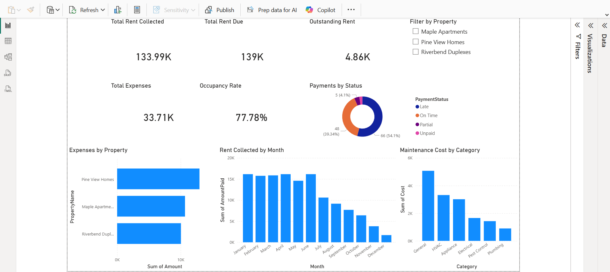
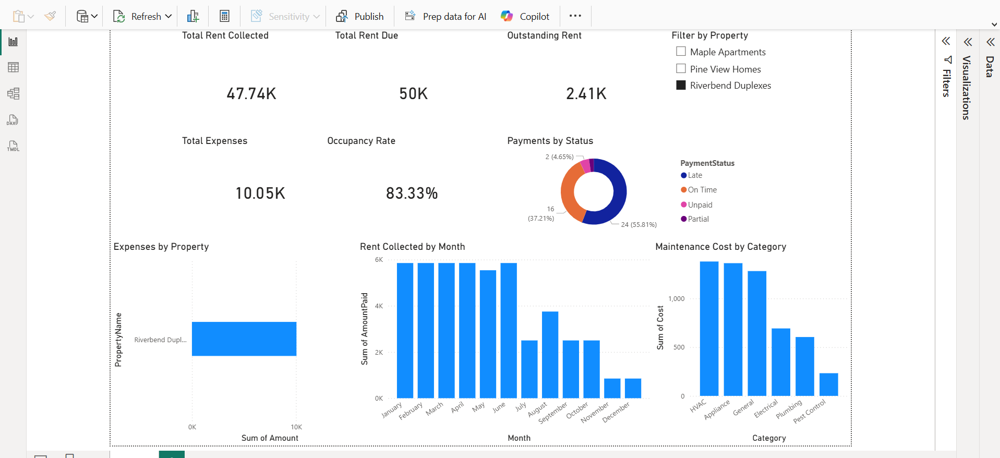

# Rental Property Dashboard

This project is an interactive Power BI dashboard built to analyze rental property performance across multiple properties.

## Project Goal

The goal of this project was to create a dashboard that helps track key rental property metrics such as rent collection, rent due, outstanding balances, expenses, occupancy rate, maintenance costs, and payment status.

## Tools Used

- Power BI
- Excel
- GitHub

## Dataset

This project uses sample rental property data organized into related tables:

- Properties
- Units
- Tenants
- RentPayments
- Maintenance
- Expenses

## Dashboard Features

The dashboard includes:

- Total Rent Collected
- Total Rent Due
- Outstanding Rent
- Total Expenses
- Occupancy Rate
- Filter by Property
- Expenses by Property
- Rent Collected by Month
- Maintenance Cost by Category
- Payments by Status

## Key Insights

- Overall occupancy rate is 77.78%
- Total rent collected is approximately $133.99K
- Outstanding rent is approximately $4.86K
- Pine View Homes has the highest total expenses in the sample dataset
- General and HVAC are the highest maintenance cost categories

## Files Included

- `RentalPropertyDashboard.pbix` - Power BI dashboard file
- `rental_property_sample_data_.xlsx` - sample dataset
- dashboard screenshots

## Screenshots

### Dashboard Overview

### Filtered View

## Notes

This project uses fictional sample data created for portfolio purposes.
